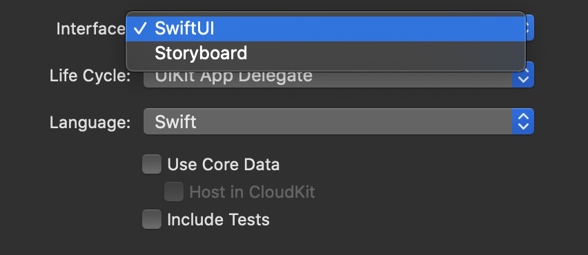
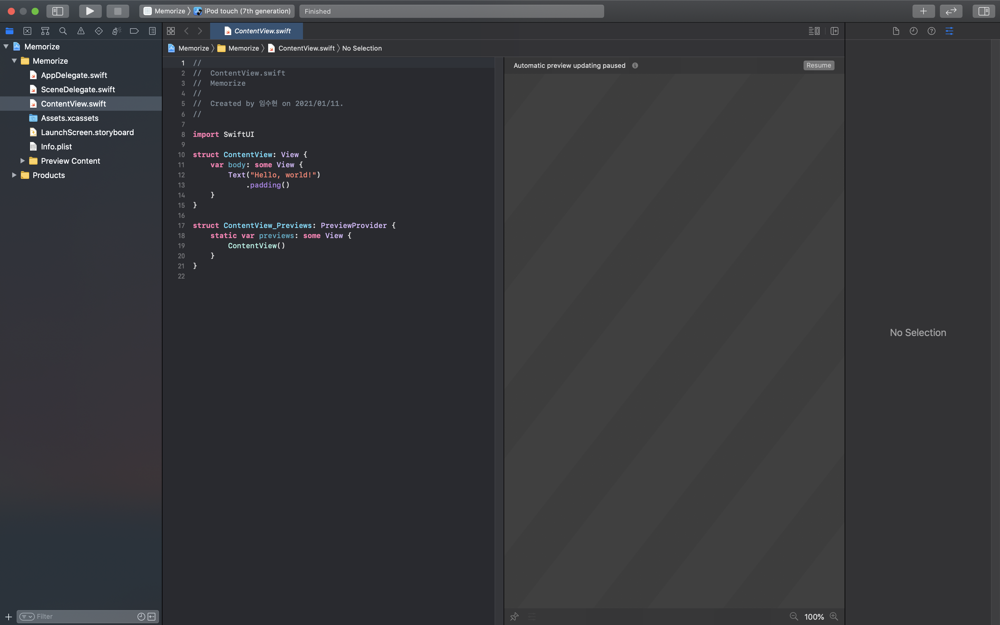

# Lecture 1 :: Course Logistics and Introduction to SwiftUI

[](https://www.youtube.com/jbtqIBpUG7g) 

## UIKit vs SwiftUI
- **UIKit** : Event-Driven
- **SwiftUI** : State-Driven

<br/>

----
## 프로젝트 생성
* SwiftUI 기반의 프로젝트를 생성하려면, Interface를 SwiftUI 로 선택해야 한다.


<br/>

* 프로젝트 생성 후 XCode화면이다.  
여기서 중요한 부분은 중앙 좌측의 **코드에디터**, 우측의 **Preview 화면**이다.  
코드의 결과는 **시뮬레이터**를 재생해서 확인 하는 방법도 있지만, UI의 작은 변화는 **Preview 화면**에서 거의 **실시간으로 업데이트** 되며, 업데이트가 중단된(pause) 경우 `Resume` 버튼을 눌러 다시 실시간 업데이트를 볼 수 있다.


> 특정 뷰에 해당하는 코드에 마우스 커서를 가져다 대면, Preview에 파란 사각형으로 해당 영역이 포커스 된다.!

<br/>

----
## 기본 코드 이해하기
```
import SwiftUI

struct ContentView: View {
    var body: some View {
        Text("Hello, world!")
    }
}
```

<br/>

### import SwiftUI
* SwiftUI를 사용하기 위한 구문이다. 기존의 UI
* import SwiftUI를 하면 Foundation 까지 포함되어 있다.

<br/>

### View
* 사각형 화면에 보여지는 뷰를 말한다. (Text 포함)
* View 내에서 swips, taps, pinches 등의 이벤트가 발생한다.
* `ContentView`는 View로 작동하며, 스크린에 표시되는 하얀 사각형(최상단) 뷰를 의미한다.

### var
* 프로퍼티를 선언하는 키워드이다.
* `ContentView`는 View 타입의 struct(구조체)이므로, 프로퍼티를 갖는다.

### body
* View를 레고조각이라고 생각하면, 하나의 뷰는 **여러개의 뷰의 조합(Combiner)**로 구성될 수 있다.
* 레고 조각들로 모여서 만들어진 뷰의 본체를 의미하는 프로퍼티.
* 뒤에 중괄호({}, 클로저 형태)가 오므로 메모리에 저장되지 않고 매번 계산되는 **computed property**이다.

### Text
* View처럼 동작하는 구조체이다. (View를 상속받았다고 이해할 수도 있지만)
* Text는 문자열로 구성되므로, 생성자의 인자로 String 문자열을 넘겨준다.

### some View
* View 처럼 작동하는 타입들 중 어느 타입이든 될 수 있다는 것을 의미한다.
* `body`가 Text를 반환하고 있으므로, `body`는 **Text**로 동작한다.

<!-- ### 이모지 넣는 법 
 `⌃` + `⌘` + `Space` -->