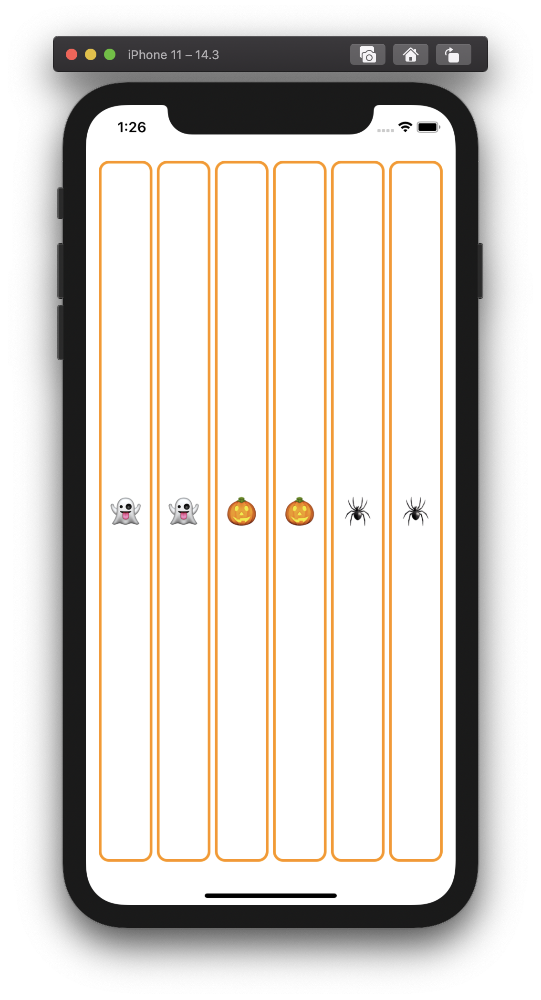
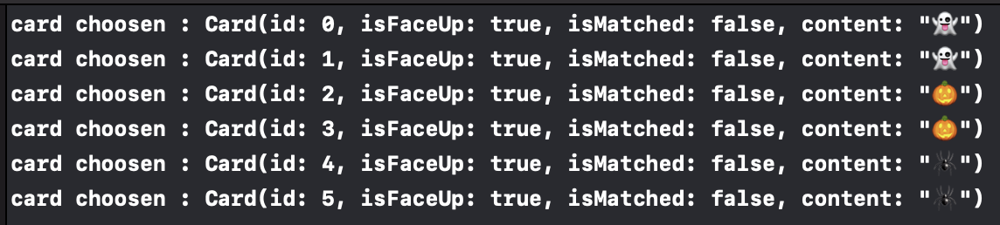

# Lecture 2 :: MVVM and the Swift Type System

[](https://www.youtube.com/watch?v=4GjXq2Sr55Q)

<br/>

---
## 🍎 MVVM
* SwiftUI에서 사용하는 디자인 패턴
* 과거 UIKit에서는 MVC를 많이 사용했다.


### Model
* UI 독립적 : SwiftUI를 import 하지 않는다.
* 데이터와 로직을 캡슐화한다.

### View
* 모델을 반영 : View 자체에서는 상태를 가지지 않으며, 모델의 상태를 반영한다.
* 데이터의 흐름 : (모델 -> 뷰) 뷰는 모델을 읽어오기만 하고, 변경할 수 없다.
* 선언적 : 간결한 코드로 선언되어 있을 뿐!
* 반응적 : 모델이 변경될 때 마다 반응하여 뷰가 자동으로 갱신된다.

### ViewModel
* 뷰를 모델에 바인딩 하는 역할
* 모델에 대한 모든것을 알고 있다. 뷰에 대해서는 알지 못한다.
* **모델의 변화를 알아챔** -> **모델을 뷰의 언어로 해석** -> **뷰 갱신(직접 대화 X)**
    - 뷰모델은 모델을 알고 있다. 모델의 변경사항이 발생하면 뷰모델이 알아챈다.
    - 뷰가 사용하기 좋도록 모델을 해석한다. 이 프로젝트에서 Model은 단순히 구조체(struct)이지만, 데이터베이스나 Http통신의 요청 결과값이 될 수도 있다. 복잡한 모델을 단순화하여 뷰가 필요한 정보만 뽑아내는 것이다.
    - 뷰모델을 뷰를 모른다. 뷰는 뷰모델을 구독하여, 변경사항이 있을 때 마다 뷰모델에게 물어봐서 자신을 변경한다.
* **Intent 처리** -> **모델 변경**
    - 뷰에서 이벤트가 발생하면 뷰모델의 Intent 함수를 호출한다.
    - 모델을 의도대로 변경한다. 모델이 struct라면 프로퍼티를 변경하는 것일 수도 있고, 데이터베이스라면 SQL문을 호출하는 것일수도 있다. 
* 이러한 양 방향의 흐름은 끊임없이 반복된다. (M->VM->V -> V->VM->M)

<br/>

### 🍋 모델과 뷰모델을 어떻게 설계하면 될까?
* 게임의 데이터와 기능을 **모델**(`MemoryGame`)로 만들것이다.  
* 모델(게임 데이터)과 뷰(게임 화면)를 연결해주는 **뷰모델**(`EmojiMemoryGame`)을 만들것이다!

<br/>

--- 
## 🍎 Struct vs Class

### 공통점
- `let` 또는 `var`로 선언된 프로퍼티를 갖는다.
- 함수를 갖는다.
- init(생성자)를 갖는다. : 클래스 또는 구조체의 상태를 초기화 하는 함수를 말한다.

### 차이점
* **Struct(구조체)**
    - **value type** : 값의 복사본을 전달함
    - **functional programming** : 함수형 프로그래밍
    - 상속 불가능
    - 모든 변수에 대해 초기값을 지정할 필요는 없다. **(initalizer 자유)**
    - **mutable** 한 값은 **명시**해야 한다.
    - **대부분의 데이터 구조**는 구조체로 구현되어 있다.
    - 초기화되지 않은 변수가 있으면 자동으로 생성자를 만들어준다.

* **Class(클래스)**
    - **reference type** : 힙 영역에 저장되고, 포인터에 의해 전달됨
    - **ARC** : 자동 레퍼런스(참조) 카운팅
    - **object-oriented programming** : 객체지향 프로그래밍
    - 상속 가능
    - 변수를 가지고 있다면 반드시 초기화해주어야 한다. **(initalizer 필수)**
    - 항상 mutable 하다. (변경 가능한 값이다.)
    - 특수한 기능으로 사용
    - SwiftUI의 MVVM 패턴에서 **ViewModel**은 반드시 **클래스**다 (많은 View들에게 공유되어야 하기 때문!)
    - 반드시 모든 변수가 초기화되어야 한다 (또는 생성자 필수)


★ SwiftUI의 View는 클래스도, 구조체도 아닌 protocol이다.

<br/>

### 🍋 모델과 뷰모델을 만들 때 struc와 class 중 어떤 것을 선택해야 할까?
 우리는 `모델`은 값을 복사하여 전달할 수 있는 **struct**로, `뷰모델`은 뷰가 참조하기 쉽도록 포인터를 가지고 있는 **class**로 만들것이다. 뷰모델은 모델을 들고 있으므로 뷰가 뷰모델을 통해 모델의 정보를 받아올 수 있다.
```
struct MemoryGame {...}
```
```
class EmojiMemoryGame {...}
```

<br/>

### 🍋 모델에는 어떤 내용이 담겨야 할까?
모델에는 게임 데이터와 기능을 담는다.
* 카드 배열
* 카드를 선택하는 기능

```
struct MemoryGame {
    var cards: Array<Card>
    func choose(card: Card) {...}
}
```
여기서 카드 정보를 담고있는 `Card`라는 구조체를 새로 만들어서 사용할 예정이다.

### 🍋 뷰모델에는 어떤 내용이 담겨야 할까?
뷰모델에는 모델에 대한 정보를 담고 있어야 한다.
```
class EmojiMemoryGame {
    var model: MemoryGame
    ...
}
```

<br/>

---
## 🍎 Generics
* 타입을 신경쓰고 싶지 않지만, Swift에서는 Type이 중요하다.
* Array의 경우 데이터를 저장하지만, 그 데이터의 타입은 Int가 될 수도 있고, String이 될수도 있다. 
* Array에 들어가는 변수, 함수의 반환형을 신경쓰지 않고 지정하는 방법이 제네릭이다.

### 정의하기
* 꺾쇠 괄호 안에 임의의 타입을 만들어준다. (placeholder 같은 역할)
    ```
    struct Array<Element> {
        ...
        func append(_ element: Element) 
    }
    ```

### 선언 및 사용하기
* 꺾쇠 안의 타입이 정해지면, 따라오는 모든 반환형이 해당 타입처럼 취급된다.
* Int 형 배열을 선언하려면 꺾쇠 안에 `Int`를 작성한다. 모든 `Element`가 `Int`로 취급된다.
    ```
    var a = Array<Int>()
    ```
* `a`는 Int형 배열로 정해졌으므로, `append(_:)`의 인자로 **Int형 데이터**만 올 수 있다.
    ```
    a.append(5)
    ```

<br/>

### 🍋 카드 정보를 담고있는 구조체(모델) 만들기 - Generic 활용
우리는 카드에 들어있는 데이터를 모델로 구조화 할 것이다. 사실, 카드에 담기는 content값은 어떤 데이터 타입이든 상관 없다! 그러므로 **Generic**을 활용하여 String값이든, Int값이든, Image가 오든 대응할 수 있도록 만들어보자.

`Card`에 포함되어야 하는 데이터는 3가지이다.
* 앞/뒷면인가?
* 일치하는가?
* 카드의 내용

이 중 **카드의 내용** 에는 어떤 데이터 타입이 와도 상관 없으니, `CardContent`라는 Generic Type을 사용한다.
```
struct Card<CardContent> {
    var isFaceUp: Bool
    var isMatched: Bool
    var content: CardContent
}
```

사실 `Card`구조체는 게임의 정보를 담고 있는 모델인 `MemoryGame`에서만 사용된다. 그래서 `Card`는 `MemoryGame`의 **내부 구조체**로 선언하면 되고, 자동적으로 `CardContent`라는 Generic Type은 `MemoryGame`에서 사용할 타입으로 지정해주면 따라오게 되어있다.
```
struct MemoryGame<CardContent> {
    var cards: Array<Card>
    func choose(card: Card) {...}

    struct Card<CardContent> {
        var isFaceUp: Bool
        var isMatched: Bool
        var content: CardContent
    }
}
```
`MemoryGame`을 선언할 때 반드시 `CardContent`에는 어떤 타입이 들어갈 지 명시해주어야 하므로, ViewModel이 가지고 있는 model에도 `CardContent` 타입을 명시해야 한다.

이 게임의 뷰모델인 `EmojiMemoryGame`은 항상 String 데이터를 가지는 모델만을 사용할 것이므로 다음과 같이 표현해주자.
```
class EmojiMemoryGame {
    var model: MemoryGame<String>
    ...
}
```

<br/>

### 🍋 뷰가 뷰모델을 통해 모델을 볼 순 있지만, 수정은 불가능하게 만들기
뷰모델을 class로 선언한 덕분에, 뷰는 언제 어디서나 뷰모델에 접근할 수 있게 되었다. 하지만, 뷰가 뷰모델을 통해 모델을 **수정**해서는 안된다.

외부에서 접근은 가능하지만 수정은 못하도록 하는 방법은 `private(set)`키워드를 사용한다. **set(설정/수정)** 하는 작업은 **private(내부에서만 가능)** 하다는 뜻이다.
```
class EmojiMemoryGame {
    var model: MemoryGame<String>
    ...
}
```


<br/>

---
## 🍎 Functions as Types
* 변수의 타입을 함수로 지정할 수 있다.  
* **사용법** : (파라미터로 들어올 타입들) -> 반환 타입
> (Int, Int) -> Bool  // 파라미터는 Int형 2개, 반환형은 Bool  
> (Double) -> Void    // 파라미터는 Double형 1개, 반환형은 없음  
> () -> Array<String> // 파라미터 없음, 반환형은 String 배열  
> () -> Void          // 파라미터 없음, 반환형 없음  

<br/>

### 예시
```
func sum(_ op1: Int, _ op2: Int) -> Int {
    return op1 + op2
}
func sub(_ op1: Int, _ op2: Int) -> Int {
    return op1 - op2
}
```
```
var operation: (Int, Int) -> Int    // operation은 Int,Int형 파라미터와 Int를 반환하는 함수는 모두 대입 가능하다.

operation = sum
let result1 = operation(1,2)    // result1 = 3

operation = sub
let result2 = operation(5,1)    // result2 = 4
```
<br/>

### 🍋 뷰모델이 모델에게 카드내용을 생성하는 함수를 전달하기
게임의 흐름은 **뷰모델**이 담당해야 하므로, **모델**을 생성하는 것도 **뷰모델**의 역할이다. 따라서 **모델을 생성하는 코드(생성자)** 를 정의하고 **뷰모델**에서 호출한다.

struct의 생성자는 항상 모든 멤버변수를 초기화해야 한다.
```
struct MemoryGame<CardContent> {
    var cards: Array<Card>
    
    init() {
        cards = Array<Card>()
        ...
    }
    ...
}
```
하지만 우리는, 뷰모델로부터 몇 쌍의 카드를 만들지 전달받아서 카드의 개수까지 지정하고 싶다. 생성자에 `numberOfPairsOfCard`라는 인자를 받아서 `cards`에 원하는 개수만큼의 Card를 추가해준다. Card() 생성자를 정의하지 않았으므로, 기본으로 제공하는 생성자를 사용해서 임의로 초기화해주자.
```
init(numberOfPairsOfCards: Int) {
    cards = Array<Card>()
    for pairIndex in 0..<numberOfPairsOfCards {
        cards.append(Card(isFaceUp: false, isMatched: false, content: ""))
        cards.append(Card(isFaceUp: false, isMatched: false, content: ""))
    }
}
```
`content`에 무엇이 들어갈지 정해주는 주체가 필요하다. 같은 쌍끼리만 같은 content가 들어가야하고, 다른 카드와는 중복이 되면 안되기 때문이다. 따라서 해당 생성자를 호출하는 **뷰모델**에서 그 작업을 실행해주어야 한다. 생성자의 인자로 **card content를 생성하는 함수**를 넘겨주어서 해당 문제를 해결할 수 있다.
```
init(numberOfPairsOfCards: Int, cardContentFactory: (Int) -> CardContent) {
    cards = Array<Card>()
    for pairIndex in 0..<numberOfPairsOfCards {
        let content = cardContentFactory(pairIndex) // 인자로 전달받은 함수의 리턴값(CardContent)
        cards.append(Card(Card(isFaceUp: false, isMatched: false,content: content))
        cards.append(Card(Card(isFaceUp: false, isMatched: false,content: content))
    }
}
```
이를 호출하는 부분은 **뷰모델**이다. 위에서 `EmojiMemoryGame`이 가지고있는 변수 `model`은 아직 초기화되지 않은 상태이다. 초기화할때 card content를 생성해주는 함수도 필요하므로, 만들어주자! Int형 인자를 가지며 String을 반환하는 함수를 정의하고, 함수 내부는 아직 신경쓰지 않겠다.
```
func createCardContent(pairIndex: Int) -> String {
    "😀"
}
```
```
private var model: MemoryGame<String> = MemoryGame<String>(numberOfPairsOfCards: 2, cardContentFactory: createCardContent)
```

<br/>

---
## 🍎 Closure
- 다른 언어의 람다와 비슷한 식
- 인라인으로 선언하는 함수 (함수도 클로저의 일종이다.)
- 상수와 변수의 reference를 캡쳐해 저장할 수 있다.

1. **전역함수**: 이름이 있고 어떤 값도 캡쳐하지 않는 클로저
2. **중첩함수**: 이름이 있고 관련한 함수로 부터 값을 캡쳐 할 수 있는 클로저
3. 경량화 된 문법으로 쓰여지고 관련된 문맥으로부터 값을 캡쳐할 수 있는 **이름이 없는 클로저**


```
func loadPicture(from server: Server, completion: (Picture) -> Void, onFailure:() -> Void) {
    if let picture = download("photo.jpg",from: server) {
        completion(picture)
    } else {
        onFailure()
    }
}
```
```
loadPicture(from: someServer) { picture in
    someView.currentPicture = picture
} onFailure: {
    print("Couldn't download the next picture")
}
```

<br/>

### 🍋 함수의 인자로 함수를 전달할 때, 클로저 문법으로 축약하기
함수의 인자로 전달하기 위해 정의한 `createCardContent(_:)`는 사실 재사용하지도 않고, 딱 모델의 생성자 한군데서만 호출되므로 이름이 필요없다. 인자로 전달되는 함수의 이름이 굳이 필요하지 않는다면 클로저 문법을 활용해 축약하는 것도 좋은 방법이다.

먼저 인자로 넘길 함수의 이름 대신 이름 뒤의 부분을 통째로 옮겨 넣는다. 
```
private var model: MemoryGame<String> = MemoryGame<String>(numberOfPairsOfCards: 2, cardContentFactory: (pairIndex: Int) -> String { // 에러!
    "😀"
})
```
그리고 중괄호 위치를 콜론(`:`)뒤로 옮기고, 함수 반환형 뒤에 `in`을 넣어준다. 
```
private var model: MemoryGame<String> = MemoryGame<String>(numberOfPairsOfCards: 2, cardContentFactory: { (pairIndex: Int) -> String in
    "😀"
})
```
더 축약하려면 인자의 타입과 반환 타입은 이미 함수가 정의될 때 알고 있는 부분이다. 따라서 인자 타입과 반환 타입은 지워도 무관하다.
```
private var model: MemoryGame<String> = MemoryGame<String>(numberOfPairsOfCards: 2, cardContentFactory: { pairIndex in
    "😀"
})
```
한줄짜리 함수인 경우, `in` 뒤로 코드를 붙여도 된다.
```
private var model: MemoryGame<String> = MemoryGame<String>(numberOfPairsOfCards: 2, cardContentFactory: { pairIndex in "😀" })
```
클로저가 마지막 인자라면, 괄호 밖으로 꺼내어 인자의 키워드까지 삭제할 수 있다.
```
private var model: MemoryGame<String> = MemoryGame<String>(numberOfPairsOfCards: 2) { pairIndex in "😀" }
```
현재 `pairIndex`는 사용하지 않기 때문에, `_`로 대체할 수 있다.
```
private var model: MemoryGame<String> = MemoryGame<String>(numberOfPairsOfCards: 2) { _ in "😀" }
```

<br/>

---
## 🍎 static
* 일반적으로 구조체나 클래스에 함수를 정의하면, 그 함수는 구조체나 클래스의 인스턴스가 생성되고 난 뒤에 호출할 수 있는 <인스턴스 함수>가 된다.
* 함수에 `static` 키워드를 붙이면 <정적 함수>가 된다. 이는 인스턴스의 함수가 아닌, **타입**에 대한 함수이다.
* 함수 뿐만 아니라 변수에도 정적(`static`) 키워드를 붙일 수 있다.
* 전체 시스템에 대해 동일하게 작동하도록 하는 방법이다.

<br/>

### 🍋 뷰모델의 변수를 초기화하는 함수를 만들기
위에서 **뷰모델** (`EmojiMemoryGame`)의 변수 `model`을 초기화 하는 코드를 많이 줄였음에도 불구하고 너무 길다! 함수를 통해 초기화 해보자.
먼저, `model`의 타입인 `MemoryGame<String>`를 반환하는 함수 `createMemoryGame()`를 정의한다. 내부는 초기화문과 동일하게 작성한다.

```
private var model: MemoryGame<String> = createMemoryGame() // 에러!

func createMemoryGame() -> MemoryGame<String> {
    return MemoryGame<String>(numberOfPairsOfCards: 2) { _ in "😀" }
}
```
함수 자체에는 문제가 없지만, 인스턴스가 생성되기도 전에 생성자에서 인스턴스 함수를 사용하려고 하기 때문이다. 함수에 `static` 키워드를 붙여 정적함수로 만들고, 타입에 대해 호출될 수 있도록 한다.
```
private var model: MemoryGame<String> = EmojiMemoryGame.createMemoryGame()

static func createMemoryGame() -> MemoryGame<String> {
    return MemoryGame<String>(numberOfPairsOfCards: 2) { _ in "😀" }
}
```

<br/>

### 🍋 카드내용을 생성하는 클로저 내부 구체화하기
지금은 카드를 생성할 때 무조건 `😀`만 넣는 형태다. 원하는 이모지들이 원하는 개수 만큼 짝을 이뤄서 들어가도록 코드를 수정해보자.
```
static func createMemoryGame() -> MemoryGame<String> {
    let emojis: Array<String> = ["👻","🎃","🕷"]
    return MemoryGame<String>(numberOfPairsOfCards: emojis.count) { pairIndex in
        return emojis[pairIndex]
    }
}
```

<br/>

---
## 🍎 Identifiable
* 프로토콜: 구조체 또는 클래스의 Constraints와 Gains
    - 반드시 구현해야 하는 항목들에 대한 제약(Constraints)
    - 프로토콜에서 누구나 사용 가능한 변수 또는 함수 획득(Gains)
* Identifier 프로토콜
    - 각 인스턴스를 식별가능하도록 함
    - 제약 : id라는 변수가 있어야 함

<br/>

### 🍋 뷰와 뷰모델을 연결하기
뷰에서 뷰모델을 연결한다. `ContentView.swift`에서 `ContentView` 구조체의 변수로 `viewModel`을 추가해준다.
```
struct ContentView: View {
    var viewModel: EmojiMemoryGame
    ...
}
```
<br/>

그러면 여기저기서 에러가 발생하는데, `ContentView`가 생성될 때 `viewModel`이 초기화되지 않아서 발생하는 에러가 대부분이다. `ContentView`가 생성되는 부분은 두군데이다.
* **SceneDelegate.swift** 의 `scene(_: willConnectTo: options:)`
* `ContentView_Previews`의 `previews`
두 곳에서 모두 코드를 추가해주어야 한다.

```
func scene(_ scene: UIScene, willConnectTo session: UISceneSession, options connectionOptions: UIScene.ConnectionOptions) {
    let game = EmojiMemoryGame()
    let contentView = ContentView(viewModel: game)
    ...
}
```
```
struct ContentView_Previews: PreviewProvider {
    static var previews: some View {
        ContentView(viewModel: EmojiMemoryGame())
    }
}
```
<br/>

### 🍋 뷰모델을 기반으로 뷰 그리기
뷰는 뷰모델에 있는 정보를 기반으로 그려지도록 구현해야 한다. 게임에 필요한 카드들의 정보는 뷰모델로부터 `EmojiMemoryGame<String>.Card` 타입의 형태로 전달될 것이다. 따라서, `CardView`에서도 `isFaceUp`이라는 변수 대신, `card`라는 변수로 바꾸고, **card 내부의 정보**를 이용하여 바꿔주는 것이 좋다.
```
struct CardView: View {
    var card: MemoryGame<String>.Card
    
    var body: some View {
        ZStack {
            if card.isFaceUp {
                RoundedRectangle(cornerRadius: 10.0).fill().foregroundColor(.white)
                RoundedRectangle(cornerRadius: 10.0).stroke(lineWidth: 3)
                Text(card.content)
            } else {
                RoundedRectangle(cornerRadius: 10.0).fill().foregroundColor(.orange)
            }
        }
    }
}
```
<br/>

이렇게 바꾸면 `ContentView`에서 `CardView`의 생성자를 호출하는 부분에서 에러가 발생한다. 생성자에 isFaceUp대신 **`card`에 대한 정보**를 넘겨주어야 한다. **ForEach** 반복을 통해, `viewModel.cards` 값을 하나하나 넣어준다.

```
ForEach(viewModel.cards) { card in
    CardView(card: card)
}
```
<br/>

하지만 ForEach 반복문에 들어가는 인자는 식별가능한 타입이어야 한다. 구조체는 일반적으로 값 타입이므로 식별이 불가능하다. 따라서 `Card`가 `Identifiable`프로토콜을 채택하도록 한다. 필수로 구현해야 하는 변수 `id`는 어떤 타입이든 상관 없다. 여기서는 **Int**로 하도록 한다!
```
struct Card: Identifiable {
    var id: Int
    var isFaceUp: Bool = true
    var isMatched: Bool = false
    var content: CardContent
}
```
<br/>

`MemoryGame`의 생성자에서 `Card`의 생성자를 호출하는 부분에서, id값까지 초기화해주는 코드도 넣어준다.
```
for pairIndex in 0..<numberOfPairsOfCards {
    let content = cardContentFactory(pairIndex)
    cards.append(Card(id: pairIndex*2, content: content))
    cards.append(Card(id: pairIndex*2 + 1, content: content))
}
```
<br/>

### 🍋 뷰에서 이벤트가 발생하면 뷰모델을 통해 모델에게 알려주기
뷰에서 카드를 터치했을 때, 모델의 `choose(card:)` 함수를 호출하도록 하고 싶다. 하지만 뷰는 모델을 알 수 없기 떄문에 뷰모델을 통해 그 정보를 전달한다.

뷰모델에는 이미 Intent 함수인 `choose(card:)`를 가지고 있다. 이것은 모델의 `choose(card:)`와는 다른 함수다! 뷰모델의 `choose`를 호출하면 모델의 `choose`를 호출하게 된다.
```
// 뷰모델의 choose
func choose(card: MemoryGame<String>.Card) {
    model.choose(card: card)
}
```
```
// 모델의 choose
func choose(card: Card) {
    print("card choosen : \(card)")
}
```

SwiftUI에서 뷰를 **"터치했을때"** 호출되는 함수는 `.onTapGesture(perform:)`이다. perform에서 viewModel.choose(card:)를 호출하면 원하는대로 작동하게 된다! (클로저로 함축 가능)
```
CardView(card: card).onTapGesture {
    viewModel.choose(card: card)
}
```
<br/>

# 완성본

